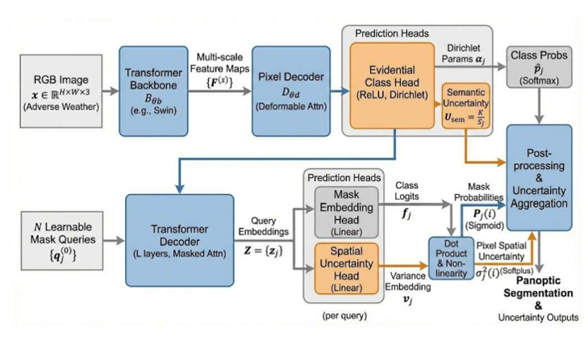
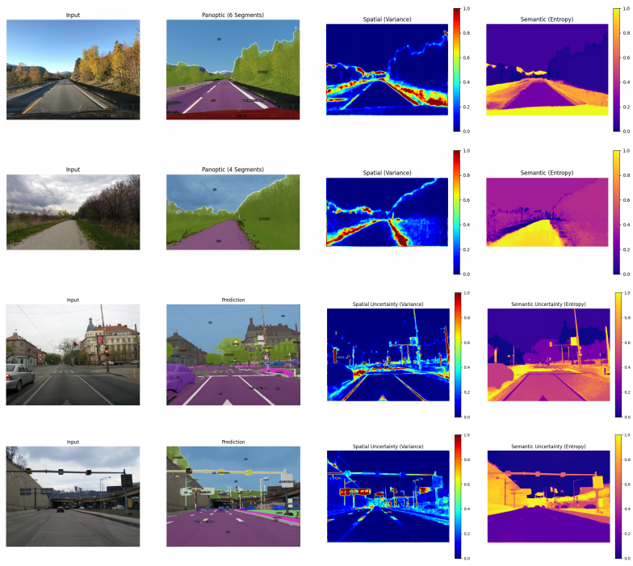

# Uncertainty-Aware Mask2Former (Core Extensions)



This repository contains the core architectural extensions and custom loss functions developed for my Master's Defense project: **Uncertainty-Aware Mask2Former for Autonomous Vehicles**. 

Rather than duplicating the entire Mask2Former framework, this repository isolates the novel dual-uncertainty contributions designed to replace standard deterministic classification.

## Core Contributions (`/src`)
Standard perception models are fundamentally overconfident. To solve this, we replace the Mask2Former Softmax head with a real-time safety buffer:
* `evidential_head.py`: An Evidential Deep Learning (EDL) head that outputs raw evidence to parameterize a Dirichlet distribution, quantifying categorical doubt (Semantic Uncertainty).
* `spatial_head.py`: A variance-based spatial head that maps boundary hesitation to a Gaussian distribution (Spatial Uncertainty).
* `losses.py`: Custom mathematical formulations including a Gaussian Negative Log-Likelihood (NLL) to attenuate spatial regression errors, and an Evidential KL-Divergence penalty.

## Visualizing Uncertainty
To understand how the mathematical extensions translate to real-world safety, we extract and visualize the raw doubt from both heads:



* **Input:** The raw RGB image captured by the vehicle's camera in adverse weather conditions.
* **Raw Segmentation Map:** The baseline panoptic prediction before safety thresholding.
* **Spatial (Variance) Map:** Extracted from the spatial head. High variance (shown in red/yellow) highlights geometric hesitation, perfectly mapping the blurry boundaries and edges of degraded objects.
* **Semantic (Entropy) Map:** Calculated from the Dirichlet expected probabilities. High predictive entropy (shown in bright yellow) highlights regions where the model lacks the categorical evidence to confidently identify an object.

## Model Configuration & Backbone
This framework leverages the powerful **Swin-Large Transformer** backbone (pre-trained on ImageNet-21k at 384x384 resolution) to extract high-resolution, multi-scale features before routing them into our dual-uncertainty heads. 

When running training or evaluation scripts, ensure you initialize the model with the corresponding configuration file:
```bash
--config-file maskformer2_swin_large_IN21k_384_bs16_300k.yaml
```

## Datasets & Data Preparation
This project utilizes two primary datasets to train and rigorously evaluate the dual-uncertainty framework.

**1. Mapillary Vistas (Training Base)**
The model was trained exclusively on the Mapillary Vistas dataset. Its high-resolution, diverse street-level imagery forces the model to learn a robust vocabulary of 65 semantic classes across varying global environments.

**2. ACDC (Zero-Shot Evaluation)**
To test the model's safety thresholding against severe distributional shifts, we performed zero-shot evaluation on the Adverse Conditions Dataset with Correspondences (ACDC). 

To reproduce our Uncertainty-Aware Panoptic Quality (UPQ) evaluation, the datasets must be organized in your root directory exactly as follows. We isolate ACDC into four distinct weather conditions to evaluate the model's abstention rate independently across Fog, Night, Rain, and Snow:

```text
datasets/
├── mapillary_vistas/
│   ├── training/
│   └── validation/
└── ACDC/
    ├── acdc_fog/
    │   ├── annotations/
    │   ├── images/
    │   └── panoptic/
    ├── acdc_night/
    │   ├── annotations/
    │   ├── images/
    │   └── panoptic/
    ├── acdc_rain/
    │   ├── annotations/
    │   ├── images/
    │   └── panoptic/
    └── acdc_snow/
        ├── annotations/
        ├── images/
        └── panoptic/
```

## Usage
These files are designed to be integrated directly into the official [Mask2Former codebase](https://github.com/facebookresearch/Mask2Former). 
1. Replace the standard linear classification head in the Transformer Decoder with the `EvidentialClassHead`.
2. Route the mask features through the `SpatialUncertaintyHead`.
3. Swap the standard Cross-Entropy loss with the composite functions provided in `losses.py`.

## Training Configuration & Hyperparameters
The model was trained to ensure reproducibility across the Mapillary Vistas dataset using the following configuration. *Computing resources were generously provided by ACCESS CI.*

| Parameter | Value |
| :--- | :--- |
| **Hardware** | NCSA Delta at UIUC (NVIDIA A100 40GB GPUs) |
| **Optimizer** | AdamW |
| **Base Learning Rate** | 1 × 10⁻⁴ |
| **Weight Decay** | 0.05 |
| **Batch Size** | 16 |
| **Training Iterations** | 90,000 (80 Epochs) |
| **Evidential Loss Weight ($\lambda_{evi}$)** | 0.005 |
| **Spatial Loss Weight ($\lambda_{spat}$)** | 0.005 |
| **Confidence Threshold ($\tau$)** | 0.8 |

### Training Stability (Handling Exploding Gradients)
Because the custom spatial variance (NLL) and evidential (KL-Divergence) losses can produce unstable gradients early in training, we enforce strict gradient clipping and utilize a polynomial learning rate scheduler with warmup to stabilize the Transformer Decoder. 

If integrating this into your own Mask2Former config, ensure these solver parameters are set:

```python
# Learning Rate Scheduler
cfg.SOLVER.LR_SCHEDULER_NAME = "WarmupPolyLR"
cfg.SOLVER.POLY_LR_POWER = 0.9

# Gradient Clipping for Probabilistic Loss Stability
cfg.SOLVER.CLIP_GRADIENTS.ENABLED = True
cfg.SOLVER.CLIP_GRADIENTS.CLIP_TYPE = "value"
cfg.SOLVER.CLIP_GRADIENTS.CLIP_VALUE = 0.01 
cfg.SOLVER.CLIP_GRADIENTS.NORM_TYPE = 2.0
```

## Documentation
The complete mathematical derivations, zero-shot evaluation on the ACDC adverse-weather dataset, and the "Trust-PQ Paradox" analysis can be found in the `/docs` folder, which includes the full Master's Report and Defense Presentation.
